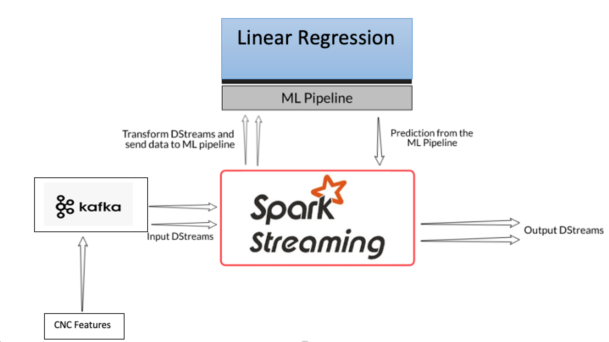

# Remianing Useful Life (RUL) prediction for CNC machines using spark streaming integrated with kafka
This project simulates RUL prediction for CNC machines in real time. The project is devided in two parts. First part is regarding preparing the data and training the model on the cloud. The second part makes prediction using spark streaming API integrated with kafka once the trained model is downloaded in the local file system.

 
